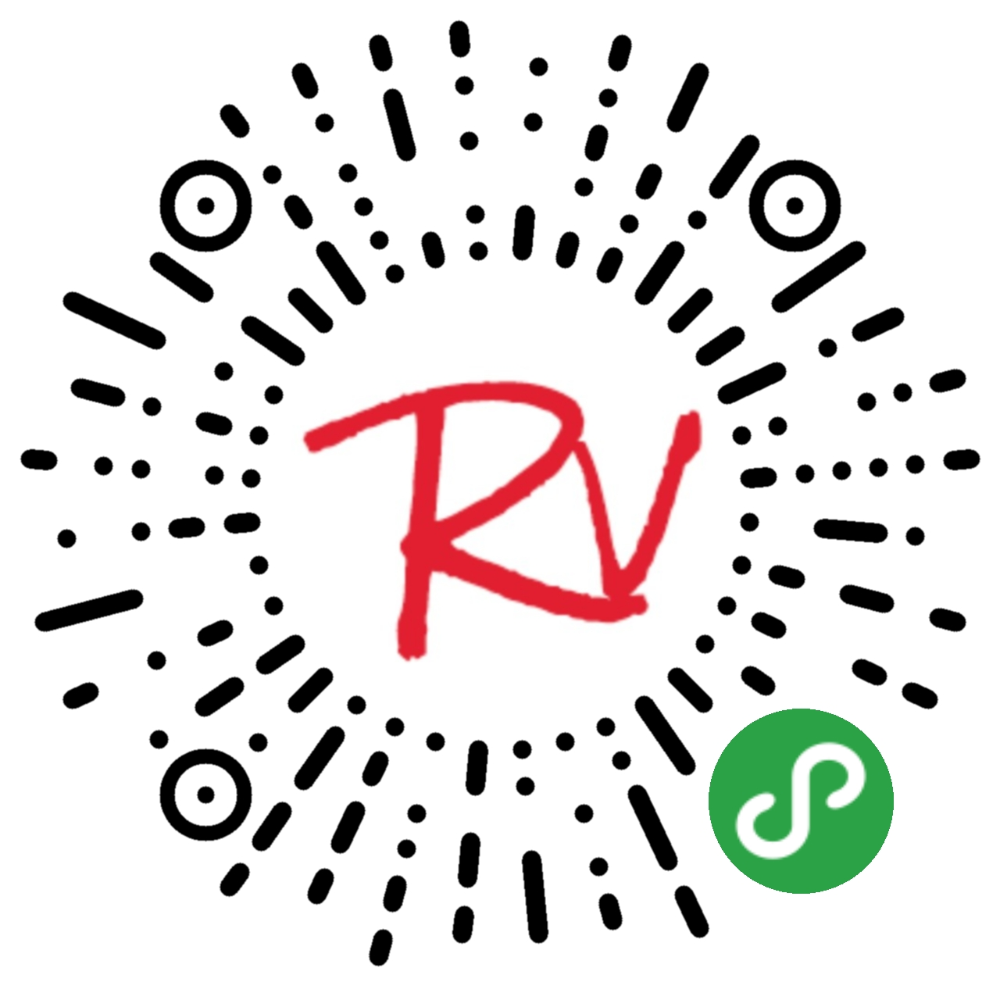

# RovingUI组件库  

## 概述
[RovingUI](https://github.com/rovinglight/rovingui-wxapp) 组件库是由个人在微信小程序开发中所构建的独立组件整合而成的。在组件设计上会偏重动态效果以及阴影的使用。  

可以扫描下面的二维码查看RovingUI组件库的DEMO👇  

## 安装使用
安装使用的具体方法看这里 👉 [组件使用文档](https://rovinglight.github.io/rovingui-weapp/)
## 贡献
欢迎提交[Issue](https://github.com/rovinglight/rovingui-weapp/issues)或者[PR](https://github.com/rovinglight/rovingui-weapp/pulls)

## 联系
Email: rovingui@rovinglight.com