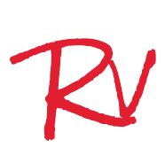

# RovingUI组件库  


## 概述
[RovingUI](https://github.com/rovinglight/rovingui-wxapp)组件库是由个人在微信小程序开发中所构建的独立组件整合而成的。在组件设计上会偏重动态效果以及阴影的使用。  

现包含按钮(btn)以及栅格(grid)组件，更多组件在来的路上。


## 开发  
在项目根目录运行👇 命令，并用微信开发者工具打开example目录。
```bash
npm run dev
```

## 安装使用
1. 使用bower来安装组件库，也可以直接下载项目，并将dist目录拷贝至小程序项目中进行引用。
```bash
bower install https://github.com/rovinglight/rovingui-wxapp.git
```
2. 在要使用的页面的json文件中的usingComponents字段中添加要使用的组件。
```json
{
  "usingComponents": {
    "rv-button": "bower_components/rovingui-wxapp/dist/btn/index"
  }
}
```
3. 在页面中直接使用。
```html
<rv-button>我是rv-button组件</rv-button>
```

## 贡献
欢迎提交[Issue](https://github.com/rovinglight/rovingui-weapp/issues)或者[PR](https://github.com/rovinglight/rovingui-weapp/pulls)

## 联系
Email: rovingui@rovinglight.com